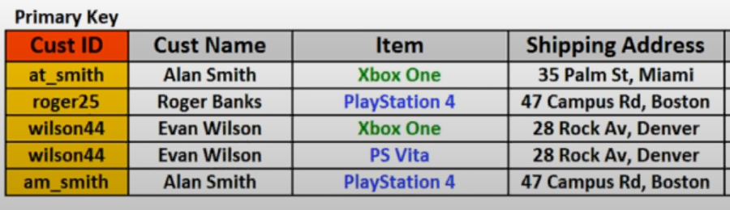

# Database Must Knows
This is some notes on databases, which we may have forgotten!

## Resources:
 - <a href="http://en.wikipedia.org/wiki/Create,_read,_update_and_delete#Database_applications">Basic CRUD Operations</a>
 - <a href="http://en.wikipedia.org/wiki/Join_(SQL)">SELECT queries with JOINs</a>
 - <a href="http://en.wikipedia.org/wiki/Database_normalization">Normalization</a>
 - <a href="http://en.wikipedia.org/wiki/Index_(database)">Basic Indexing</a>
 - <a href="http://en.wikipedia.org/wiki/Referential_integrity">Referential Integrity</a> with <a href="http://en.wikipedia.org/wiki/Foreign_key">Foreign Key Constraints</a>
 - <a href="http://en.wikipedia.org/wiki/Check_Constraint"> Basic Check Constraints</a>

---

## Basic CRUD Operations
  - Create: `INSERT`, 
  - Read: `SELECT`, 
  - Update: `UPDATE`, 
  - Delete: `DELETE`, 

--- 

## `SELECT` queries with `JOINs`
  - Join is used when you have tables that are related somehow and you want to retrieve data from both tables, on a specific value.
  - We have several Join types, where each of them will have an different impact on the output. 
  - Syntax:
  ```sql
      SELECT  <tablename>.<colname>, _, ...
      FROM <tablename_1>
      <Join_type> JOIN <tablename_2>
      ON <tablename_1>.<colname> = <tablename_2>.<colname>
      WHERE <conditions>
      ORDER BY <somevalue>;
  ```
  - Joins:
    - `Inner Join`:
      - Returns only connected rows when there is a matching field (id) in both rows.
    - `Left Join`:
      - Returns every row from the left table, even if there is no matching row in the right table. 
    - `Right Join `:
      - Return every row from the right table, even if there is no matching row in the left table.
    - `Full Join`:
      -  Combination of left and right join, and returns everything from both tables. 
    - `Self Join`:
      - Its possible to join a table with it self, returning relations based on the value we want to `join on`.

--- 

## <a href="https://www.youtube.com/watch?v=UrYLYV7WSHM&ab_channel=channel5567">Normalization</a>
  - Normalization is the process of structuring a relational database into multiple related tables, to <b>`minimize Data Redundancy`</b> and improve <b>`Data Integrity`</b>.  
  - This is done by splitting and structuring tables into separated ``logical``, `independent`, but `related data`. 
  - Normalization can be achieved in these three-four normal forms:

    - <b>1'st Normal Form</b>
      - ``Each cell`` need to be ``Single Valued``
      - ``Entries`` in a ``column`` are of the ``same type``
      - ``Rows`` are ``uniquely identified``

     ``Before`` (single valued, uniquely identified - Cust ID)
      
      <br>
      <br>
      ``After``
      

    - <b>2'nd Normal Form</b>
      - `All attributes` (Non-Key Columns) are ``dependent`` on the ``key``<br>

      `Before`
      
      <br>
      <br>
      ``After``
      
    
      ```
      Here we see that the Item, supplier, supplier phone and price don't depend on the key (cust id), so they have to separated out.
        
      Now to keep the relations we had before the sepatation, we create a new table called a Junction Table. A junction table contains the primary key columns of the two tables we want to relate, and keep our relationships in place.
      ```

    - <b>3'rd Normal Form</b>
      - `All Fields` (columns) can be determined <b>`Only`</b> by the `Key` in the table and no other column. In other words, if we repeat data that never change and always stick together, then that data should be abstracted out, into another table.
      
      `Before`
      
      <br>
      <br>
      ``After``
      

      ```
      Here the Item Table has redundant data when we look at the phone number. The phone number for microsoft or sony doesn't change, so having to add it along side every item is an issue. 
      
      Therefore we separate redundant data belonging to a specific table, into another table, and store it ONCE for each type. 
      This is also very beneficial when updating such rarely changing data, because we only need to change it at ONE place. 
      ```

    - <b>4'th Normal Form, BCNF</b>
      - No `multi-valued` dependencies, 
        - This one is a little more tricky. In basic terms it means that the amount of rows in one column should be equal the amount of rows in the other columns. 
        - Lets say you have 3 credit cards, and one shipping address. Now you as the user decide to add another shipping address, but which credit card should be put into the credit card field for the new shipping address? Should you just pick a random one? No, Separate.....

      `Before`
      
      <br>
      <br>
      ``After``
      

      ```
      Now that the customer table and the newsletter table are separated, we se that redundant data such as cust name, and shipping address only comes once. And if we where to update the customer shipping address, we would update it at one place, and not for every newsletter assigned to that shipping address. 
      ``` 


--- 

## Basic Indexing
  -  An index is a structure associated with a table or view that speeds retrieval of rows from the tables. 
  - We wont need this i think.

---

## Referential Integrity with Foreign Key Constraints
  - Trust your data. Need to respect Foreign Key Constraint or else the whole thing would be a big cluster f.

--- 

## Basic Check Constraints
...

--- 


